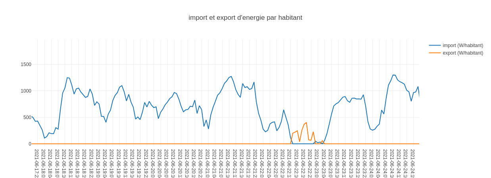
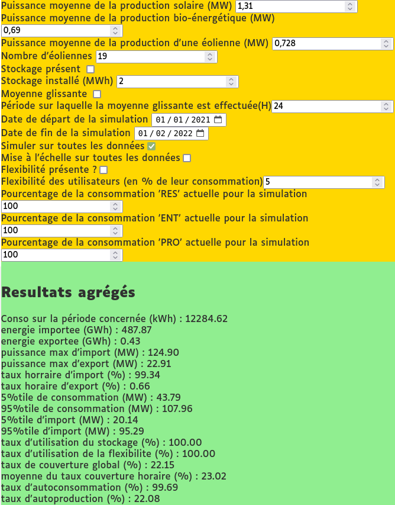
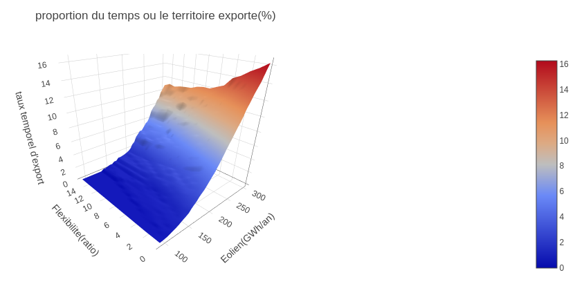

# Project presentation
This program is made for the [ELFE project](https://www.projet-elfe.fr) (Experimentons Localement la Flexibilite Energetique).

The project is a real-scale experiment where we try to maximize the efficiency of the local renewable energy production by using it when available, introducing "flexibility factors" by driving part of the consumption of volunteer citizens and professionals. It is based on the assumption that certain things can be delayed, such as dishwashers, hot water tanks, freezers... without having a negative impact on the volunteer's life.

This repository is currently a program to evaluate the impact of some factors such as flexibility, storage... on electricity import/export of the area.

The program in this repository use:
  * aggregated open-data provided by [Enedis](https://data.enedis.fr/explore/dataset/conso-inf36-region), as a base to compute an average consumption for french "région Bretagne" 
  * Béganne windturbine's production history as its power source, 
  * results of internal simulation for different power scenarios over a 1 year perdio.
in order to **simulate scenarios** and serve as a base for the next step of the ELFE project, which is building the *Energy Management System*.

# Tutorial and web interface
The results of this program can be vizualized thourgh a Django webapplication.The output are as follows:
### 2D simulations

### 3D vizualizer
The webapp also allows to display results of simulations (that were run on a dedicated simulation computer) for many factors of the scenarios, and observe multi-factor variations:

A video tutorial was recorded to follow along the documentation. You may find it (in French) here: https://www.youtube.com/watch?v=K3Gfxax8DKk

# Energy Producer
The energy producer is (at the moment) a **citizen-owned wind farm** composed of 3 site projects: Begawatts (Béganne 56), Isac-Watts (Sévérac-Guenrouët 44) and Tesdan le vent (Avessac 44).

Other power sources from the area may be incorporated as the project goes on, such as **PV producers** or **biomethane-to-power** plants.

# Convention
For the moment:
  * all electric power will be expressed in Watt/200 users
  * all energy will be expressed in Watt.h/200 users
  * timestamps in files will be parsed to become dd/mm/yyyy:hh

# Project website:
https://www.projet-elfe.fr/

# Licence
to be determined

# Contributors
to be completed
